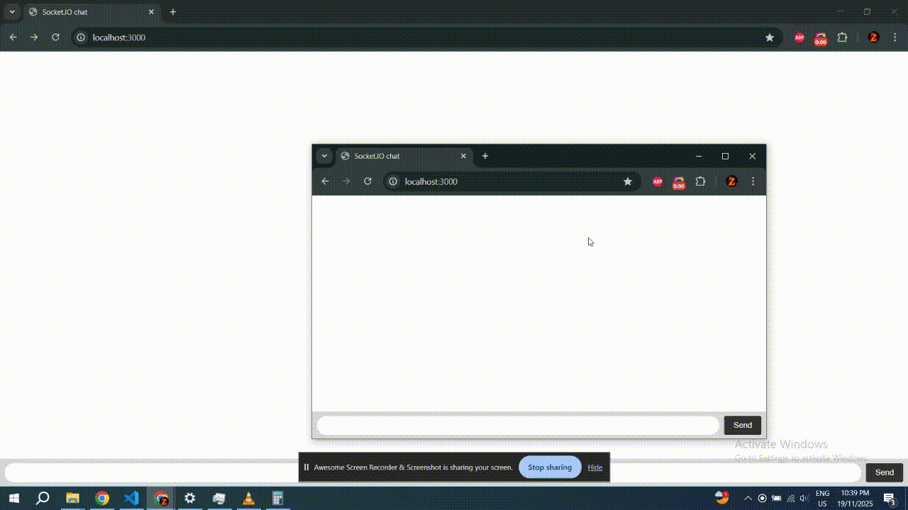

# Real-time Chat app

A simple Node.js chat app using ExpressJS and SocketIO.

## Installation

1. Clone the repository:

   ```sh
   git clone https://github.com/ziadTarek30/Chat-app.git
   ```

2. Install the project dependencies

   ```sh
    cd Chat-app
    npm install
   ```

3. To run the app in production mode
   ```sh
   npm start
   ```

## Demo


